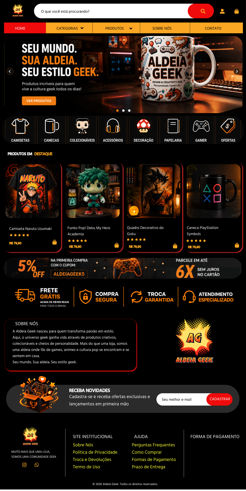

# 🎮 Aldeia Geek

Aldeia Geek é um projeto de e-commerce voltado para o universo geek,
desenvolvido como parte dos meus estudos em desenvolvimento web.

O projeto passou pelas etapas de briefing, definição do escopo,
prototipação no Figma e desenvolvimento utilizando HTML, CSS e JavaScript.

## 🎨 Protótipo no Figma

Antes de iniciar o desenvolvimento, foi criado um protótipo no Figma
para definir a identidade visual, organização das seções e experiência
da página.

## 💻 Tecnologias utilizadas

- HTML5
- CSS3
- JavaScript
- Figma
- Git
- GitHub

## ✨ Funcionalidades

- Layout responsivo para desktop, tablet e smartphone
- Menu hambúrguer em dispositivos móveis
- Categorias de produtos
- Cards de produtos com efeitos de hover
- Seção de benefícios
- Newsletter
- Rodapé com redes sociais

## 📚 O que aprendi

Durante o desenvolvimento deste projeto, pude praticar principalmente
a estruturação de páginas com HTML, estilização com CSS, responsividade
com Media Queries e algumas interações utilizando JavaScript.

O projeto também me permitiu praticar o uso de Git e GitHub para
versionamento de código.

## 🤖 Apoio durante o desenvolvimento

Durante o desenvolvimento, utilizei o ChatGPT (OpenAI) como ferramenta
de apoio para aprendizado, esclarecimento de dúvidas, revisão de código
e resolução de problemas encontrados durante a implementação.

## 📌 Observação

Este projeto foi desenvolvido para fins de estudo e portfólio.
A Aldeia Geek é um projeto fictício e não representa uma loja real.
